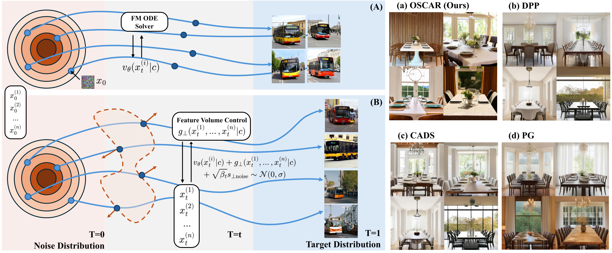

# Oscar — ORTHOGONAL STOCHASTIC CONTROL FOR ALIGNMENT-RESPECTING DIVERSITY IN FLOW MATCHING

[](https://arxiv.org/abs/2510.09060)

> **Official implementation of our paper:**
> **OSCAR: ORTHOGONAL STOCHASTIC CONTROL FOR ALIGNMENT-RESPECTING DIVERSITY IN FLOW MATCHING**
> arXiv: https://arxiv.org/abs/2510.09060

This repository provides the official codebase for **Oscar**. It includes:

- **`scripts/`** — three baselines (**DPP**, **CADS**, **PG**) and **our method** for SD3/SD3.5 (Diffusers).
- **`experiments/`** — experiment drivers used to reproduce the results in our paper.
- **`eval/`** — unified evaluation tools (coverage/diversity/quality) and CSV aggregation.
- Reference pointers for **DIM/CIM** diversity evaluation (see: [https://github.com/facebookresearch/DIMCIM](https://github.com/facebookresearch/DIMCIM)).

---

## Overview

<p align="center">
  
</p>


<p align="center">
  <em>Figure — Our guidance mechanism: OSCAR applies orthogonal stochastic control to steer flow-matching trajectories for diversity while respecting alignment.</em><br>
</p>

---

## Table of Contents

- [Installation](#installation)
- [Models &amp; Checkpoints](#models--checkpoints)
- [Quick Start](#quick-start)
- [DIM/CIM Reference Evaluation](#dimcim-reference-evaluation)
- [Citing](#citing)
- [License](#license)

---

## Installation

```bash
git clone https://github.com/Johnny221B/OSCAR
cd OSCAR
python -m venv .venv && source .venv/bin/activate
pip install -U pip
pip install -e .
```

## Models & Checkpoints

- Use local **Diffusers** SD3 / SD3.5 pipelines. Example layout:`models/stable-diffusion-3.5-medium/`
- Loaders auto-resolve nested directories by searching for `model_index.json`.

**OpenAI CLIP (JIT):** Provide a local `ViT-B-32.pt`, for example, `~/.cache/clip/ViT-B-32.pt`. The code falls back to **open\_clip** if the JIT file is unavailable.

## Quick Start

```
    CUDA_VISIBLE_DEVICES=0,1 python -u scripts/ourmethod.py \
      --spec multi_class.json \
      --guidances 3.0 \
      --seeds 1111 2222 3333 4444 \
      --model-dir ./models/stable-diffusion-3.5-medium \
      --clip-jit ~/.cache/clip/ViT-B-32.pt
```

## DIM/CIM Reference Evaluation

For DIM/CIM (diversity) evaluation, please follow the official repository:[https://github.com/facebookresearch/DIMCIM](https://github.com/facebookresearch/DIMCIM)

**Typical workflow:**

1. Generate images with this repo (by concept/prompt/guidance/seed).
2. Use DIM/CIM’s evaluation code to compute their diversity metrics.
3. Optionally align our CSV outputs for side-by-side comparisons.

## Citing

If you find this repository useful, please consider to cite:

```
@misc{wu2025oscarorthogonalstochasticcontrol,
  author       = {\textbf{Jingxuan Wu} and Zhenglin Wan and Xingrui Yu and Yuzhe Yang and Bo An and Ivor Tsang},
  title        = {OSCAR: Orthogonal Stochastic Control for Alignment-Respecting Diversity in {Flow Matching}},
  year         = {2025},
  eprinttype   = {arxiv},
  eprint       = {2510.09060},
  primaryClass = {cs.AI},
  url          = {[https://arxiv.org/abs/2510.09060](https://arxiv.org/abs/2510.09060)},
}
```

## License

This project is released under the **MIT License**.See the [LICENSE](./LICENSE) file for the full text.

> Optional (recommended): add an SPDX tag to source files:
>
> ```text
> SPDX-License-Identifier: MIT
>
> ```
